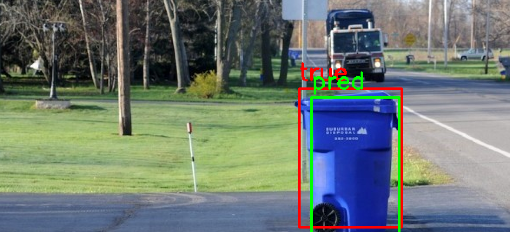
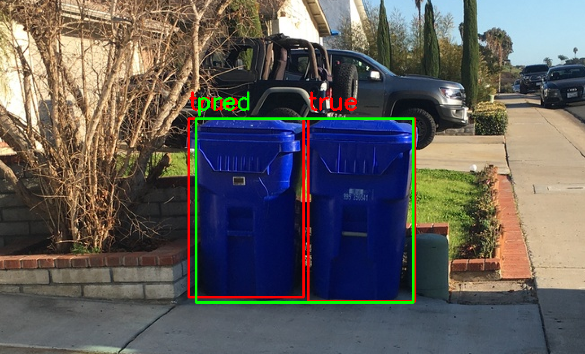
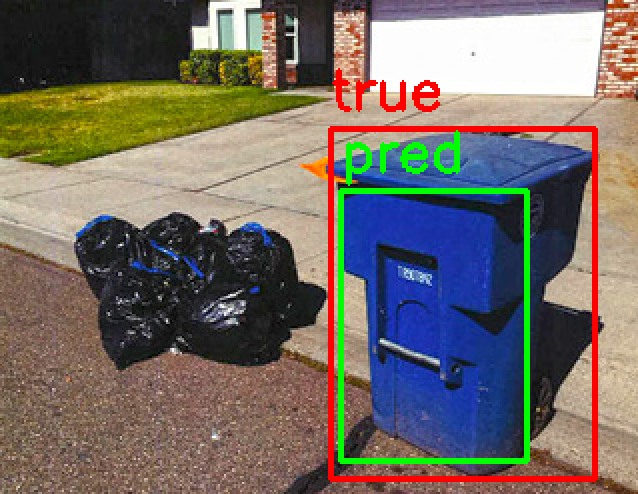
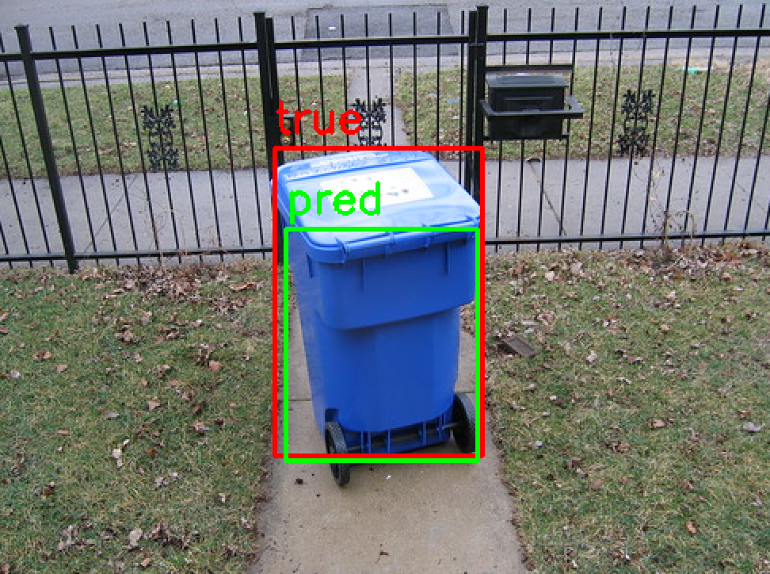
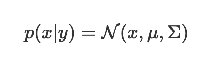
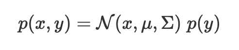
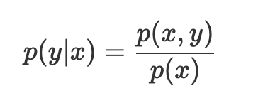
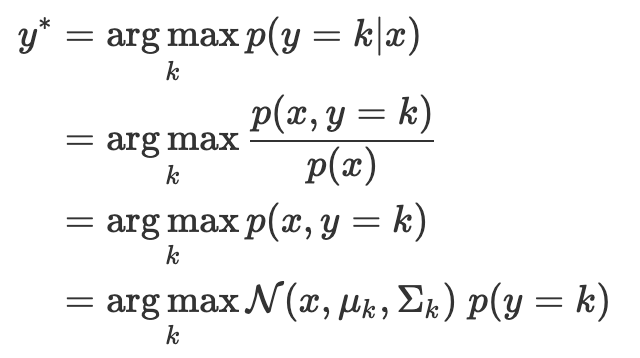

# Trash Bin Detection

This repository contains code for detecting blue trash bin using gaussian classifier.

## Examples
|
--|--
|

## Requirements
To install requirements:

```setup
pip install -r requirements.txt
```

## Training

To train the model(s), run this command:

```train
python training.py
```

## Evaluation
To evaluate the model:

```eval
python test_bin_detector.py
```

## Modeling Distributions
We can use gaussian distribution to model the class distribution of a particular label. y = {blue, not blue}


Using bayes rule, we can write the joint probability as


Therefore the posterior can be written as


Our classifier is therefore in the form:

